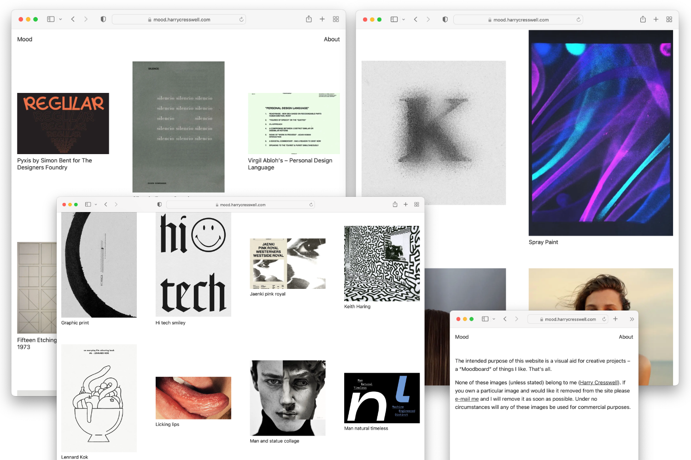

# Mood

A lightweight, JavaScript-free [Hugo](https://gohugo.io/) theme for moodboarding.



## Live demo

- https://mood.harrycresswell.com/

## Features

- Clean and simple design
- Page specific meta titles
- Responsive layout
- SCSS support for local development
- Minimal inlined CSS for production
- [Cloudinary](https://cloudinary.com/) image hosting
- Page specific keywords
- Low quality Image placeholders (LQIP)
- Next-gen image formats (WebP & AVIF)
- Immutable image caching
- Image proxying with Netlify Redirects
- 100/100 score on Lighthouse
- SEO optimized (Twitter cards, Facebook Open Graph)
- Superlite (Only ~3kb of CSS)

## Installation

[Install Hugo](https://gohugo.io/getting-started/installing/), then create a new site.

```
hugo new your-site-name
```

Navigate to the root directory of your project and initialise Git:

```
git init
```

With Git initialised, install this repository in the `themes/` directory:

```
git submodule add https://github.com/harrycresswell/mood.git themes/mood
git submodule update --init --recursive
```

You should now be able to navigate to `themes/mood` and see all of the theme files.

## Updating your site to the latest version of the theme

To update your site to the current version of the theme, navigate to the root directory of your project and run the following:

```
git submodule update --remote --merge
```

Ensure you replace your existing `assets` folder with the one found in `themes/mood`.

Now commit and push your changes, as normal.

## Choose a specific theme verison

Move to the theme directory and list all available versions:

```
cd themes/mood
git tag
```

Checkout a specific version:

```
git checkout tags/<version-name>
```

## Configuration

First, move the `config.toml` and `netlify.toml` files from `themes/mood/exampleSite` to the root of your new project.

Make sure `mood` is set as your default theme at the top of your `config.toml` file:

```
theme = "mood"
```

Next, head to [Cloudinary.com](https://cloudinary.com/) and set up a free account.

When you have a Cloudinary account set up, open `netlify.toml` and update the `to` value under redirects to your Cloudinary cloud name. 

```
[[redirects]]
from = "/images/:format/:quality/:width/*"
# Replace “your-cloud-name” in URL below to your actual cloud name
to = "https://res.cloudinary.com/your-cloud-name/image/upload/:format/:quality/:width/:splat"
status = 200
```

You can find your cloud name on your Cloudinary dashboard.

Inside `config.toml`, under the `[params]` section update `cloudinary_url` to include your cloud name.

Finally, move the _assets_ folder including it’s contents from the _themes/mood_ folder to the root of your project.


## Adding content

Use the `hugo` command to create new posts.

```
hugo new post/your-post-title.md
```

You will find comments in the front matter that explain how to format data correctly.

Add pages in the same manner.

```
hugo new some-page-name.md
```

If you prefer to start your project with demo content, then replace your /content folder with `themes/mood/exampleSite/content`.

## Tagging content

When using the `hugo` command to create new post, the post archetype will populate the front matter of your new post with tag examples. Simply replace these tags with your own.

## Managing menu items

Configure your menu items in the _config.toml_ file.

```toml
[menu]
[[menu.main]]
  name = "About"
  url = "/about"
  weight = 5
[[menu.main]]
  name = "Contact"
  url = "/contact"
  weight = 10
[[menu.main]]
  name = "Some other page"
  url = "/some-other-page"
  weight = 10 
```

## Run a local development server

Run `hugo server` to start Hugo’s built-in web server.

```
hugo server
```

Then head to http://localhost:1313/ to view your site in the browser.

## Deploying with Netlify

To take advantage of image proxying and image caching make sure you host your site using [Netlify](https://www.netlify.com/).

Steps to reproduce:

1. Follow [Installation](#installation) and [Configuration](#configuration)
2. Create a new repository on GitHub, GitLab or Bitbucket
3. Push your site to remote repository
4. Creat new site with continuous deployment

**Struggling to get set up?** Follow the [Host on Netlify](https://gohugo.io/hosting-and-deployment/hosting-on-netlify/) tutorial in the Hugo Docs.

## Author

Harry Cresswell

- https://github.com/harrycresswell
- https://twitter.com/harrycresswell

## Problems?

Email me [studio@harrycresswell.com](mailto:studio@harrycresswell.com).

## Licence

Copyright 2022 [Harry Cresswell](https://harrycresswell.com/)

This theme has been released under the MIT License. Check the original license for additional licensing information.
